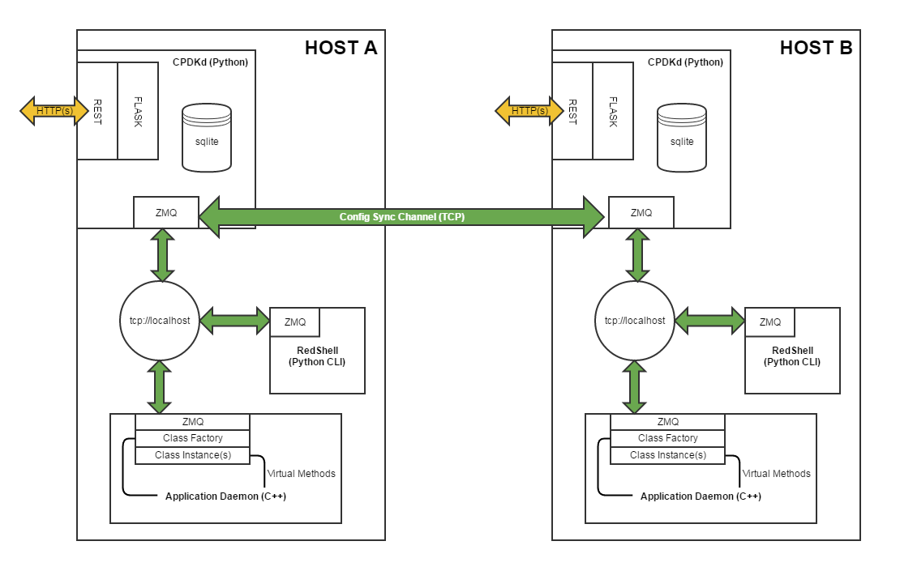

.. CPDK documentation master file, created by
   sphinx-quickstart on Thu Dec  1 09:21:30 2016.
   You can adapt this file completely to your liking, but it should at least
   contain the root `toctree` directive.

Welcome to the CPDK documentation!
==================================

What is CPDK?
-------------
The Control Plane Development Kit (CPDK) is a collection of utilities and applications which allows developers
to quickly, and painlessly, integrate control plane functionality into their application.

You, the developer, presumably write daemons to provide specific processing logic which requires user interaction for
configuration purposes. The CPDK provides the pieces needed to interact with the user and hooks directly into your
application via base C++ classes you override to handle configuration changes.

The high level architecture of CPDK is shown in the following diagram

Batteries Included
------------------
- Python-based control plane daemon (CPCKd)
- Python-based CLI Daemon (RedShell)
- Generated CLI schema (easily customizable)
- Generated C++ classes (header-files only)
   - Singleton management class for each database model
   - Base class, representing each instantiation of model

Pre-Release Disclaimer
----------------------
Until CPDK reaches 1.0, please be aware that the interfaces may change (perhaps significantly) from release to release.
We strongly encourage early adopters to resist deploying CPDK in major projects until we get to 1.0 - thanks!

CPDK Workflow Overview
----------------------
The CPDK workflow can be quickly described in three steps:

1. Define
2. Generate
3. Integrate

**Define**

The first step in the workflow is to define your database *schema*. What information needs to be stored in the database?
What information needs to be shared between daemons, the CLI, and *NOT* stored in the database (yes, we can do that too!).

**Generate**

Run the ``cpdk-util.py`` script to create a database schema, CLI schema, and C++ header files.

**Integrate**

After the code generator is run, it's time to integrate the generated C++ code with your own logic.

Table of Contents
=================
.. toctree::
   :maxdepth: 2

   internals